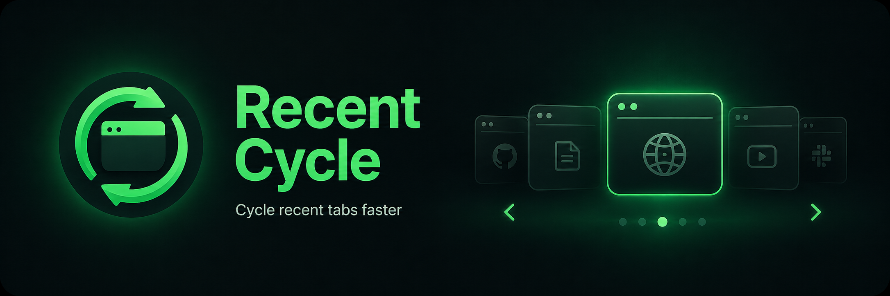
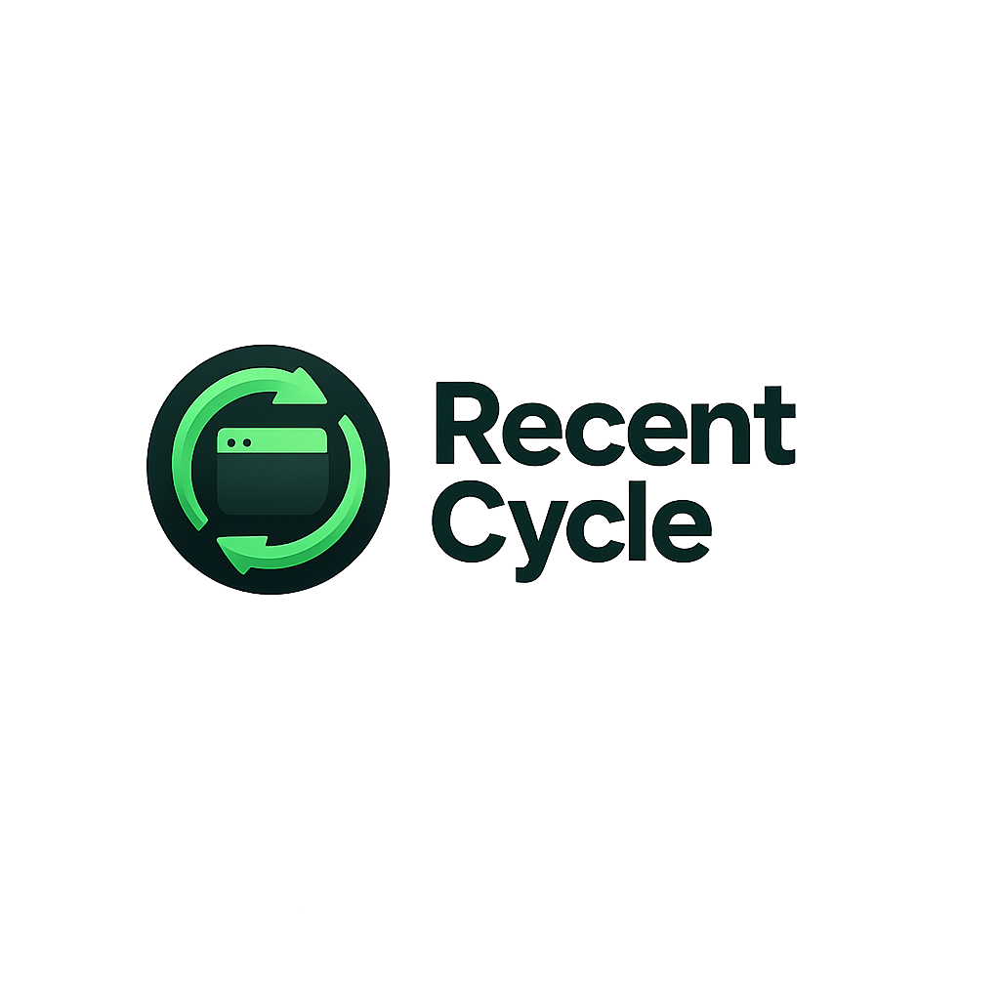

<p align="center">
  
</p>

<div align="center">
  
</div>

# Recent Cycle

Alt-Tab for your tabs. A small, local-first Manifest V3 Chrome extension that cycles through your
most recently used tabs with a single shortcut. Fast tap to switch, or hold the key to preview and
pick. No accounts, no network, no telemetry.

<p align="center">
  
  
  
</p>

---

## Quick start

The whole install — extension **and** the optional macOS companion — in one command:

```sh
curl -fsSL https://raw.githubusercontent.com/wahyudichrisdianto/recent-cycle/main/install.sh | bash
```

Then finish in Chrome (two clicks):

1. Open `chrome://extensions` → **Load unpacked** → select
   `~/Library/Application Support/Recent Cycle/extension`.
2. Open `chrome://extensions/shortcuts` and set the forward shortcut scope to **Global**.

Prefer a zip? Jump to [Install](#install) for all the options.

---

## What it does

- **Fast tap** — hit the shortcut and switch instantly to the next most-recent tab.
- **Hold-to-cycle** — hold `Option`, tap `Tab`/`Shift+Tab` to move through a small in-page list,
  release `Option` to commit the switch.
- **Protected pages** — with the companion installed, exact hold-to-preview keeps working on
  `chrome://settings`, `chrome://extensions`, and the New Tab page, where Chrome blocks scripts.
- **Config dashboard** — clicking the extension icon opens a live view of your registered shortcuts,
  the fast-tap/hold gesture map, companion status, and the recent-tab list.

### Shortcuts

| Platform | Forward | Backward (hold-only) |
| --- | --- | --- |
| macOS | `Option+Tab` | `Option+Shift+Tab` |
| Windows / Linux | `Ctrl+Shift+9` | `Ctrl+Shift+0` |

> Windows/Linux keep these default because `Ctrl+Tab` and the backtick key are Chrome-reserved.
> Rebind anything via `chrome://extensions/shortcuts` if a combination is already taken.

## The companion (what it's for)

Chrome prevents extensions from running scripts on **protected pages** (`chrome://settings`,
`chrome://extensions`, the internal New Tab page). Without a script there, the extension can't
sense when you physically release `Option` — so on those pages each `Option+Tab` would stay an
independent silent switch, with no preview list.

The **companion** is a tiny local macOS process (a Chrome Native Messaging host, written in Swift)
that observes *only* the global Option/Shift/Tab key state and sends it to the extension over a
local stdio pipe. With it, hold-to-preview works on protected pages too:

- **Optional** — browser-only fast-tap mode always works without installing anything.
- **Private** — it does not read characters, log keystrokes, use the network, or run shell commands.
- **macOS-only** — Windows/Linux use the safe browser-only path until signed hosts ship.

## Install options

Two ways, both install the same package:

### Option A — extract the zip

1. Download the latest bundle from
   [GitHub Releases](https://github.com/wahyudichrisdianto/recent-cycle/releases/latest).
2. Unzip it and open `chrome://extensions`.
3. Enable **Developer mode** (top right).
4. Click **Load unpacked** and select the extracted `recent-cycle` folder.
5. Want hold behavior on protected pages? Copy the extension id from `chrome://extensions`, then:

   ```sh
   cd recent-cycle
   ./native/install.sh <32-character-extension-id>
   ```

6. Set the forward shortcut scope to **Global** in `chrome://extensions/shortcuts`.

### Option B — one-line installer (curl)

Pipes the [install.sh](install.sh) from the GitHub repo:

```sh
curl -fsSL https://raw.githubusercontent.com/wahyudichrisdianto/recent-cycle/main/install.sh | bash
```

It downloads the latest release zip, extracts it to `~/Library/Application Support/Recent Cycle/extension`,
computes the extension id from that fixed path, builds and registers the macOS companion for that
exact id, then prints the final two Chrome steps. The installer has three modes:

| Mode | Command |
| --- | --- |
| **Full install** (default) | `curl -fsSL https://raw.githubusercontent.com/wahyudichrisdianto/recent-cycle/main/install.sh \| bash` |
| **Clean setup** (wipes any previous install, then full) | `curl -fsSL https://raw.githubusercontent.com/wahyudichrisdianto/recent-cycle/main/install.sh \| bash -s -- --clean` |
| **Companion only** (re-register the host, leave extension alone) | `curl -fsSL https://raw.githubusercontent.com/wahyudichrisdianto/recent-cycle/main/install.sh \| bash -s -- --companion-only --extension-id <your-id>` |

Other flags: `--extension-id <id>`, `--no-companion` (extract only), `--version <ver>` (pin a
tagged release), `--package-url <url>` (self-hosted mirror). Run `install.sh --help` for everything.

The companion step applies on macOS only; elsewhere the installer extracts the extension and skips
the native host.

### If your default branch is `master`

GitHub-created repos default to `main`. If your default branch is `master`, swap that literally in
the commands above.

## Uninstall

- **Extension** — remove it from `chrome://extensions`.
- **Companion** — run `./native/uninstall.sh` to remove the host binary and its Chrome manifest, then
  revoke its Accessibility permission in System Settings → Privacy & Security → Accessibility.

## Manual (developer) setup

```sh
npm install          # no dependencies to fetch, but keeps npm happy
npm test             # run the MRU + gesture unit tests
./scripts/build-release.sh   # build release/recent-cycle-<ver>.zip
```

1. Open `chrome://extensions` → enable **Developer mode** → **Load unpacked** → select this folder.
2. macOS: run `./native/install.sh <extension-id>` for exact cross-context hold behavior.
3. Set the forward shortcut scope to **Global**.

## Project layout

| Path | Purpose |
| --- | --- |
| `manifest.json` | MV3 extension manifest (permissions, shortcuts, service worker). |
| `background.js` | Service worker: MRU bookkeeping, command handling, overlay + companion bridge. |
| `popup.html/css/js` | Configuration dashboard (shortcuts, gesture map, companion status, recent list). |
| `companion.html/css` | In-extension setup guide shown for the companion. |
| `cycle-overlay.js` | Temporary in-page hold-to-cycle preview list. |
| `gesture-state.js` | State machine for fast-tap vs hold-to-cycle sessions. |
| `mru.js` | The MRU ordering engine (also unit-tested standalone). |
| `native/` | macOS Native Messaging host (Swift) + `install.sh` / `uninstall.sh`. |
| `scripts/build-release.sh` | Assembles the clean release zip into `release/`. |
| `test/` | Unit tests (`background`, `gesture-state`, `mru`). |
| `docs/` | Architecture and design notes. |

## Troubleshooting

- **Preview list doesn't appear on a protected page** — the companion isn't registered (or lacks
  Accessibility permission). Run the companion-only install (Option B) or
  `./native/install.sh <id>`, then approve the macOS prompt.
- **Shortcut does nothing** — Chrome reserves it or the command is unbound. Reassign it in
  `chrome://extensions/shortcuts`.
- **`Option+Tab` consumed while the popup is open** — the shortcut scope is set to "In Chrome".
  Switch it to **Global**.
- **Windows/Linux host missing** — expected. Those platforms run browser-only mode.

## Privacy

No network client, host permissions, telemetry, remote assets, or external service. `activeTab`
and `scripting` are used only after a keyboard command to install a temporary local overlay. The
companion observes only Option/Shift/Tab state, does not retain keystrokes, and sends no arbitrary
character data. Extension cycle state stays in `chrome.storage.session`.

## License

[Apache License 2.0](LICENSE) — © 2026 Wahyu Dichi Chrisdianto.